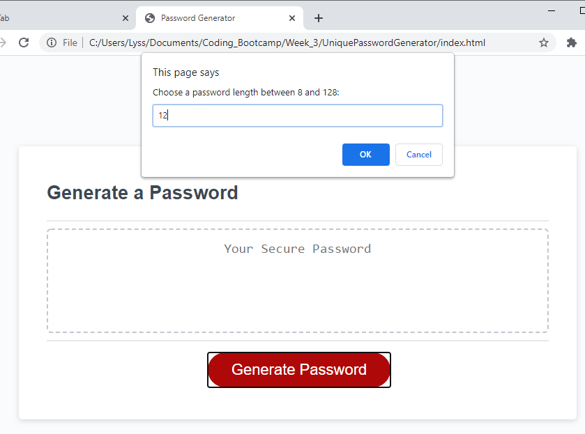
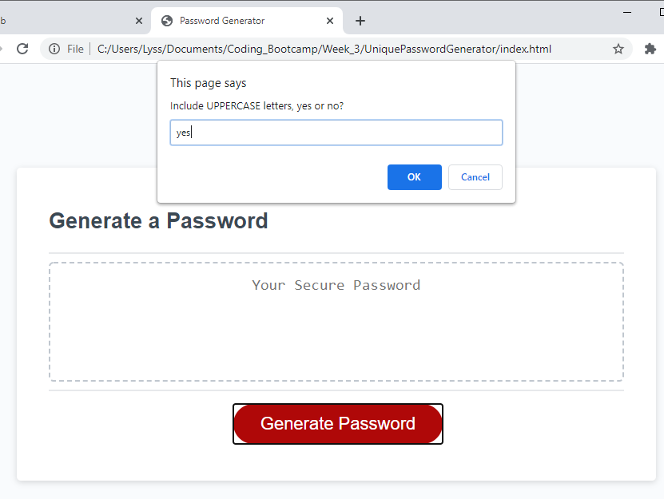
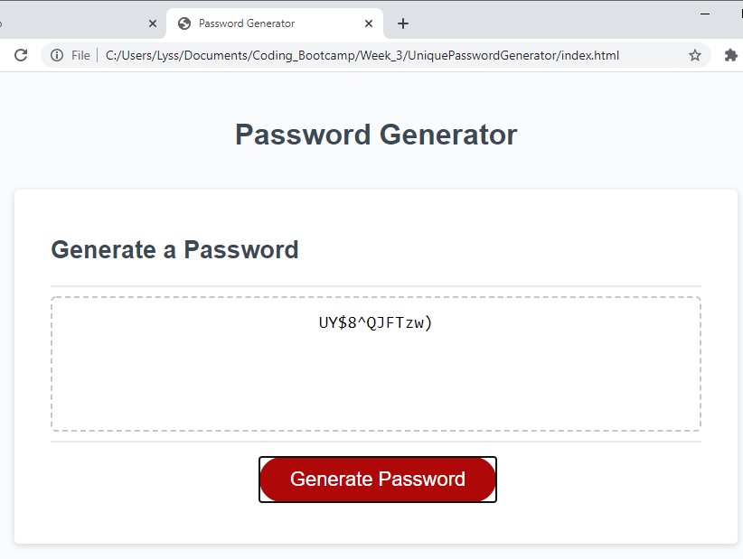

# UniquePasswordGenerator

## Description
This project was designed to create a random and unique password based on user input of password length, and which characters to include using a series of prompts. This project taught me to combine multiple functions in javascript, how to appropriately call these functions within another function, and how to start a function when a button is clicked. Looping through the prompts until correct the correct input is received was another challenge. I broke the task into chunks, testing each section of code before moving to the next section, which helped make the tasks easier to complete. 

## Usage
Click on the "Generate Password" button. This will initiate a series of prompts in order to determine the required password length, and yes or no prompts to determine which characters will be included from the following options:
    *upper case letters
    *lower case letters
    *numbers
    *symbols

Once all the correct input is received, a random password of specified length will be generated and the text will be shown in the password box. If you click the button again, you will go through the prompts again and a new password will be generated and stored, overwriting the previous password. 

Button clicked, prompts begin starting with length:

A series of yes/no prompts will appear:

A random password is generated:

## Link
https://aanolan51.github.io/UniquePasswordGenerator/

## Credits
1. https://www.youtube.com/watch?v=iKo9pDKKHnc
2. https://www.codecademy.com/forum_questions/54de5c2586f552b10a0029b9
3. https://www.tutorialspoint.com/how-to-create-a-password-generator-javascript
4. https://www.dummies.com/web-design-development/javascript/how-to-prompt-the-user-for-input-in-javascript/
5. https://stackoverflow.com/questions/37287093/starting-a-javascript-prompt-after-a-button-is-clicked/37287126

